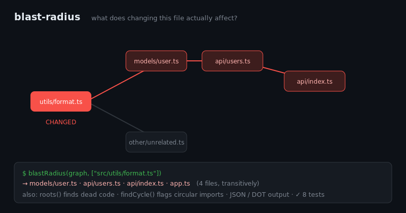

# blast-radius

[](https://github.com/JCreatesGH/blast-radius/actions)
[](https://www.typescriptlang.org/)
[](LICENSE)

Answer the question every reviewer asks: **"what does this change actually affect?"** `blast-radius` builds the import graph of a JS/TS project and computes the transitive set of files impacted by a change — plus dead-code roots and circular-import detection.



## Install

```bash
npm install blast-radius
```

## Use it

```ts
import { buildGraph, blastRadius, roots, findCycle, unreachable, toDot } from "blast-radius";

const graph = buildGraph(fileContents);          // { "src/a.ts": "<source>", ... }

blastRadius(graph, ["src/utils/format.ts"]);     // every file that imports it, transitively
unreachable(graph, ["src/index.ts"]);            // dead code: files no entrypoint reaches
roots(graph);                                    // files nothing imports (entrypoints / dead code)
findCycle(graph);                                // a circular-import path, or null
toDot(graph, blastRadius(graph, changed));       // Graphviz with affected nodes highlighted
```

## CLI

Installing the package adds a `blast-radius` command that walks a real project (exits 1 on a cycle):

```bash
$ blast-radius src --changed "$(git diff --name-only | paste -sd, -)"
$ blast-radius src --entry src/index.ts          # report dead (unreachable) files
$ blast-radius src --json                        # machine-readable report
```

## How it works

- **Import extraction** handles `import … from`, re-exports (`export … from`), side-effect imports, dynamic `import()`, and `require()` — and ignores commented-out lines and bare (node_modules) specifiers.
- **Resolution** maps relative specifiers to real files across `.ts/.tsx/.js/.jsx/.mjs/.cjs` and `index.*` directory imports.
- **Blast radius** is a reverse-dependency BFS over the graph, so it's exact and fast.
- **Outputs** — `toJSON` (for D3/vis) and `toDot` (for Graphviz), with affected nodes flagged.

Everything works on an in-memory `{path: source}` map, so it's fully unit-tested and trivial to wire to `git diff --name-only`.

## Development

```bash
npm install && npm test    # 12 tests
npm run build              # tsc, clean
```

## License

MIT
